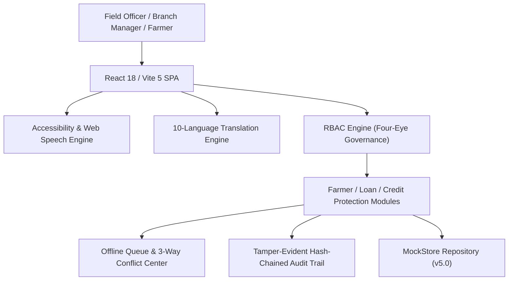

# AgriSahay: An Explainable, Offline-First, Multilingual and Climate-Aware Agriculture Lending Platform for Inclusive Rural Credit Delivery

> **Academic Research & Placement Prototype Notice:**  
> This project is an applied academic research prototype developed for rural banking and placement showcase evaluation in Small Finance Bank agricultural credit operations. It is **not connected to a live banking system, real customer database, or external financial network**. All borrower profiles, land titles, and financial records are simulated demo data.

---

## 🌾 Research Problem & Objective

Smallholder farmers in rainfed and semi-arid tracts face compounding structural barriers to institutional credit:
1. **Opaque and Inflexible Credit Underwriting:** Standard credit scoring relies on urban-centric bureau history and rigid monthly Equal Monthly Installment (EMI) schedules that disregard the seasonal gestation of agricultural cash flows.
2. **Connectivity Shadow Zones:** Over 60% of rural farm visits occur in low-connectivity or zero-network shadow zones, resulting in paper-based duplicate origination and synchronization collisions.
3. **Linguistic Exclusion:** Banking interfaces are predominantly English or formal state-register vernaculars that use complex financial terminology inaccessible to marginal agriculturalists.
4. **Climate Exposure & Delayed Claim Settlements:** Increasing frequency of unseasonal rains and localized dry spells triggers crop failure, while paper-based loss intimation under PMFBY often exceeds the mandatory 72-hour window.

**AgriSahay** bridges this gap with an explainable, offline-first, multilingual, and climate-aware digital architecture designed to evaluate whether these barriers can be mitigated empirically.

---

## 🔬 Research Questions & Protocol (RQ1 – RQ7)

| ID | Research Question | Primary Metric | Target Benchmark |
| :--- | :--- | :--- | :--- |
| **RQ1** | **Task Efficiency:** Does a guided, offline-first digital field workflow reduce end-to-end loan application origination time compared to traditional paper-and-branch procedures? | Elapsed task completion time (seconds) | $\ge 40\%$ reduction across 6 core tasks |
| **RQ2** | **Explainability & Transparency:** Does the Explainable Farmer Resilience Index improve credit officer confidence and borrower comprehension over opaque scorecards? | 5-point Likert comprehension score & override justification audit | Mean rating $\ge 4.2 / 5.0$ |
| **RQ3** | **Repayment Feasibility:** How does harvest-linked bullet/tranche repayment scheduling alter projected borrower default probability under simulated climate stress? | Cumulative monthly cash flow surplus & deficit frequency | Zero mid-season cash deficit months |
| **RQ4** | **Linguistic Accessibility:** Can native Indic scripts (10 languages) combined with Web Speech synthesis reduce borrower cognitive load and comprehension friction? | Reading & audio comprehension check score | $\ge 85\%$ accuracy on core financial terms |
| **RQ5** | **Offline Conflict Resolution:** Can deterministic 3-way reconciliation prevent data loss during multi-officer field data synchronization? | Conflict resolution success rate & zero unhandled collisions | $100\%$ atomic merge completion |
| **RQ6** | **Credit Protection Acceleration:** Does mobile-first PMFBY loss intimation with simulated GPS/photo verification reduce claim initiation latency within the 72-hour statutory deadline? | Intimation submission timestamp delta | $100\%$ intimated within $< 48$ hours |
| **RQ7** | **System Usability:** What is the standardized System Usability Scale (SUS) score of the platform across diverse user cohorts (officers, managers, farmers)? | Brooke (1986) 10-item composite SUS score | SUS $\ge 75$ (Grade A, Above Average) |

---

## 🏛️ System Architecture & Technology Stack



| Component Layer | Technology Implementation | Key Architectural Properties |
| :--- | :--- | :--- |
| **Frontend Framework** | React 18 & Vite 5 | SPA with ES modules, route-level code splitting (`React.lazy`), fast HMR |
| **Styling & Design System** | Pure CSS & Indic Font Stack | Professional light theme, zero heavy CSS frameworks, WCAG 2.1 AA line-height (`1.6`) |
| **Audio Accessibility** | Browser Web Speech API | Native `speechSynthesis`, zero cloud voice APIs, BCP-47 Indic tags, rural analogies |
| **Multilingual Core** | Zero-Dependency i18n Core | Static pre-compiled dictionaries for 10 languages, 3-tier fallback chain |
| **Datastore & State** | Client-Side MockStore (v5.0) | Schema migration, JSON corruption auto-healing, and 24 domain stores |
| **Governance & RBAC** | RBAC Engine | Maker-Checker roles: Branch Manager, Relationship Officer, Operations Admin, Researcher |
| **Audit Security** | Cryptographic Hash Chaining | Forward-chained audit trail ($H_i = \text{Hash}(H_{i-1} \mathbin{\Vert} \text{Record}_i)$) with tamper verification |
| **Privacy & Masking** | Regex Masking Engine | Guaranteed Aadhaar masking (`XXXX-XXXX-1234`), $k$-anonymity suppression ($N < 5$) |
| **Testing Harness** | Node.js Test Suite | 98 passing unit tests across resilience, climate, translation, and governance |

---

## 🚀 Quick Start & Local Execution

### Prerequisites
- Node.js (v18.0.0 or higher, Node 20+ recommended)
- npm (v9.0.0 or higher)
- PostgreSQL (v14+ optional; runs in-memory demo fallback if unconfigured)

### 1. Run Automated Tests
```bash
npm test
```
*Executes all 118 automated unit and security tests across 5 test suites (Resilience, Climate, 10-Language i18n, Governance, and Backend Security).*

### 2. Run Secure Express Backend
```bash
npm run server
```
*Starts the Express/Node.js API with JWT authentication, sliding-window rate limiter, and cryptographic forward hash-chained audit logging on `http://localhost:5000`.*

### 3. Run Frontend Development Server
```bash
npm run dev
```
*Launches the React 18 / Vite 5 client on `http://localhost:5173/`.*

### 4. Database Migrations (Optional for PostgreSQL)
```bash
npm run migrate
```
*Applies 15 relational tables with check constraints and indices defined in `server/database/schema.sql`.*

### 5. Production Build
```bash
npm run build
```
*Generates an optimized, code-split production bundle in `dist/`.*

---

## 🌟 Core Domain Innovations

### 1. Explainable Farmer Resilience Index
Calculates a transparent score ($0-100$) based on 7 weighted agricultural factors:
- **Irrigation Access (20 pts):** Perennial canal/borewell vs. rainfed
- **Crop Diversity (15 pts):** Polyculture vs. monoculture
- **Climate Exposure (15 pts):** Regional monsoon departure index
- **Credit & Leverage (20 pts):** Debt-to-income margin and on-time track record
- **Allied Dairy Income (15 pts):** Secondary livestock cash-flow buffer
- **Soil & Agronomy (10 pts):** Verified Soil Health Card nutrient protocol
- **Insurance Protection (5 pts):** Active PMFBY enrollment

*Includes confidence penalties for missing fields, officer discretionary score overrides with mandatory text justifications, and the required governance notice: Decision support only. A human loan officer must review and decide.*

### 2. Multi-Scenario Harvest Repayment Cash-Flow Curves
Generates month-by-month cash flow projections connecting crop stages (Land Prep, Basal Sowing, Weeding, Harvesting) to post-harvest APMC Mandi realization across:
- **Expected Baseline:** Standard historical yield and price
- **Best-Case (+20% yield, -5% expenses):** Bumper harvest realization
- **Worst-Case (-35% yield, +20% expenses):** Localized climate shock / price crash

### 3. Credit Protection Center (PMFBY & Restructuring)
Integrates a complete 8-stage loss-to-restructuring pipeline:
- 72-hour countdown timer for localized disaster intimation
- Mobile loss logging with simulated GPS coordinates and crop condition photos
- Independent surveyor inspection tracking
- Direct transition into RBI-authorized loan restructuring (moratorium extension & tenure recalibration)

### 4. Offline Conflict Reconciliation & Sync Monitor
Deterministic 3-way reconciliation (Base vs. Field vs. Branch):
- Dual-officer collision simulator
- Side-by-side visual diff highlighting
- Field-by-field merge options with mandatory officer justification comments
- Dedicated Sync Monitor (`/sync-monitor`) with idempotency key telemetry and exponential retry backoff

### 5. Research & Usability Evaluation Lab
- Precision stopwatch timers for standard benchmark tasks (`T1` through `T6`)
- Standard Brooke (1986) 10-item System Usability Scale (SUS) survey
- Traditional manual baseline comparison with automated percentage time reduction
- Optional bannered sample dataset with one-click purge
- DPDP differential privacy ($N < 5$ suppression) and multi-format research dataset export (CSV, JSON, Anonymized)

### 6. 10-Language Full-Page Translation & Accessibility
Supports: English, हिन्दी (Hindi), ಕನ್ನಡ (Kannada), தமிழ் (Tamil), తెలుగు (Telugu), मराठी (Marathi), বাংলা (Bengali), മലയാളം (Malayalam), ગુજરાતી (Gujarati), and ਪੰਜਾਬੀ (Punjabi).
- Web Speech API text-to-speech with Indic BCP-47 tags
- Simplified agrarian analogies for 8 core banking concepts
- Text size scaling (Normal, Large, Extra Large) and High-Contrast mode

### 7. Phase 6 Secure Backend & Admin Operations Telemetry
- Express / PostgreSQL architecture with connection pooling and in-memory demo fallback
- Bearer token authentication with bcrypt password hashing and 8-hour session expiration
- Four-Eye dual control: Relationship Officers originate; Branch Managers sanction (self-approval prohibited)
- Admin Operations Dashboard (`/admin-ops`) showing real-time API uptime, TAT metrics, and cryptographic hash chain verification

---

## 📚 Complete Project Documentation

### Architecture & Engineering
- [Backend Architecture Specification](file:///c:/Users/gokul/Desktop/PROJECTS/agri_bnk/docs/BACKEND_ARCHITECTURE.md)
- [REST API Documentation](file:///c:/Users/gokul/Desktop/PROJECTS/agri_bnk/docs/API_DOCUMENTATION.md)
- [Relational Database Schema (PostgreSQL DDL)](file:///c:/Users/gokul/Desktop/PROJECTS/agri_bnk/docs/DATABASE_SCHEMA.md)
- [Security Model & Dual-Control Governance](file:///c:/Users/gokul/Desktop/PROJECTS/agri_bnk/docs/SECURITY_MODEL.md)
- [STRIDE Threat Model & Mitigations](file:///c:/Users/gokul/Desktop/PROJECTS/agri_bnk/docs/THREAT_MODEL.md)
- [Deployment & Operations Guide](file:///c:/Users/gokul/Desktop/PROJECTS/agri_bnk/docs/DEPLOYMENT_GUIDE.md)

### Research & Usability Evaluation
- [Pilot Study Guide & SUS Protocol](file:///c:/Users/gokul/Desktop/PROJECTS/agri_bnk/docs/PILOT_STUDY_GUIDE.md)
- [Research Protocol (RQ1 – RQ7)](file:///c:/Users/gokul/Desktop/PROJECTS/agri_bnk/docs/RESEARCH_PROTOCOL.md)
- [Empirical Evaluation Plan & SUS Methodology](file:///c:/Users/gokul/Desktop/PROJECTS/agri_bnk/docs/EVALUATION_PLAN.md)
- [Algorithmic Fairness & Bias Governance](file:///c:/Users/gokul/Desktop/PROJECTS/agri_bnk/docs/FAIRNESS_AND_BIAS.md)
- [Accessibility & Rural Interface Guidelines](file:///c:/Users/gokul/Desktop/PROJECTS/agri_bnk/docs/ACCESSIBILITY.md)
- [Offline-First Architecture & Conflict Reconciliation](file:///c:/Users/gokul/Desktop/PROJECTS/agri_bnk/docs/OFFLINE_SYNC_DESIGN.md)
- [Data Governance, DPDP Act 2023 & Audit Trail](file:///c:/Users/gokul/Desktop/PROJECTS/agri_bnk/docs/DATA_GOVERNANCE.md)
- [10-Language i18n Architecture Guide](file:///c:/Users/gokul/Desktop/PROJECTS/agri_bnk/docs/I18N_ARCHITECTURE.md)
- [Agricultural Banking Translation Glossary](file:///c:/Users/gokul/Desktop/PROJECTS/agri_bnk/docs/TRANSLATION_GLOSSARY.md)

### Placement & Demonstration
- [36 Placement Interview Questions & Answers](file:///c:/Users/gokul/Desktop/PROJECTS/agri_bnk/docs/INTERVIEW_PREP.md)
- [5-Minute & 10-Minute Live Demo Scripts](file:///c:/Users/gokul/Desktop/PROJECTS/agri_bnk/docs/DEMO_SCRIPT.md)

---

## 📄 License & Academic Disclaimer

This project is an **academic prototype** created strictly for demonstration, evaluation, and educational purposes. It is not affiliated with, endorsed by, or connected to Ujjivan Small Finance Bank, UIDAI, or RBI live banking infrastructure. All customer identities, land records, and account numbers are simulated demo artifacts.
