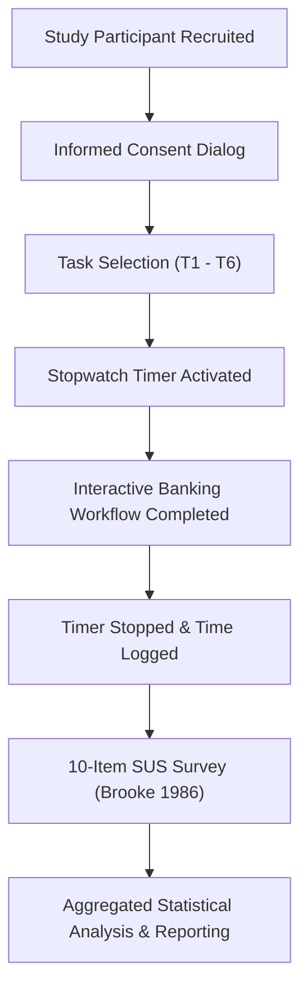

# AgriSahay Empirical Evaluation Plan & Usability Methodology

---

## 1. Evaluation Architecture & Overview
The AgriSahay evaluation methodology combines objective task instrumentation (precision timers, error logging) with standardized psychometric evaluation (System Usability Scale - Brooke 1986) to establish quantifiable performance against traditional paper-and-branch rural banking workflows.

---

## 2. Standardized Usability Scale (SUS) Implementation (Brooke, 1986)

### 2.1 The 10 Standard Items
Participants rate their agreement with 10 standardized statements on a 5-point Likert scale (1 = Strongly Disagree, 5 = Strongly Agree):

1. **Q1:** I think that I would like to use this system frequently.
2. **Q2:** I found the system unnecessarily complex.
3. **Q3:** I thought the system was easy to use.
4. **Q4:** I think that I would need the support of a technical person to be able to use this system.
5. **Q5:** I found the various functions in this system were well integrated.
6. **Q6:** I thought there was too much inconsistency in this system.
7. **Q7:** I would imagine that most people would learn to use this system very quickly.
8. **Q8:** I found the system very cumbersome to use.
9. **Q9:** I felt very confident using the system.
10. **Q10:** I needed to learn a lot of things before I could get going with this system.

### 2.2 Mathematical Scoring Formula
For odd-numbered items ($Q_1, Q_3, Q_5, Q_7, Q_9$):
$$\text{Item Score} = \text{Response} - 1$$

For even-numbered items ($Q_2, Q_4, Q_6, Q_8, Q_{10}$):
$$\text{Item Score} = 5 - \text{Response}$$

Composite SUS Score:
$$\text{SUS} = \left(\sum_{i=1}^{10} \text{Item Score}_i\right) \times 2.5$$

Yields an overall score ranging from $0$ to $100$.

### 2.3 Adjective & Grade Benchmark Scale
- **$85.0 - 100.0$:** Grade A+ (Excellent / Industry Benchmark)
- **$80.0 - 84.9$:** Grade A (Good)
- **$68.0 - 79.9$:** Grade B (Acceptable / Above Average)
- **$50.0 - 67.9$:** Grade C (Marginal / Needs Improvement)
- **$< 50.0$:** Grade F (Unacceptable / High Cognitive Friction)

---

## 3. Quantitative Statistical Framework

For all recorded task completion times $X = \{x_1, x_2, \dots, x_N\}$:

### 3.1 Arithmetic Mean
$$\bar{x} = \frac{1}{N} \sum_{i=1}^N x_i$$

### 3.2 Median
$$\tilde{x} = \begin{cases} x_{(N+1)/2} & \text{if } N \text{ is odd} \\ \frac{x_{(N/2)} + x_{(N/2 + 1)}}{2} & \text{if } N \text{ is even} \end{cases}$$

### 3.3 Sample Standard Deviation ($s$)
$$s = \sqrt{\frac{1}{N-1} \sum_{i=1}^N (x_i - \bar{x})^2}$$

### 3.4 Percentage Efficiency Improvement ($\Delta\%$)
$$\Delta\% = \left(\frac{T_{\text{Traditional}} - \bar{x}_{\text{AgriSahay}}}{T_{\text{Traditional}}}\right) \times 100$$

---

## 4. Empirical Evaluation Protocol Steps

1. **Environment Preparation:**
   - Initialize browser in target language (e.g., Kannada, Hindi, Marathi).
   - Ensure local storage is initialized with baseline demo state or clear study data.
2. **Task Execution:**
   - Participant navigates to the Research Evaluation Dashboard (`/research-dashboard`).
   - Evaluator launches stopwatch timer for the assigned task (`T1` through `T6`).
   - Participant operates the designated screen to complete the banking operation.
   - Evaluator stops the timer upon successful completion and records any operator errors or hesitation pauses.
3. **Survey Administration:**
   - Participant completes the 10-item SUS questionnaire and provides qualitative open-ended remarks.
4. **Data Privacy Guard:**
   - Verify that all exported datasets enforce differential privacy and $k$-anonymity suppression ($N < 5$).
