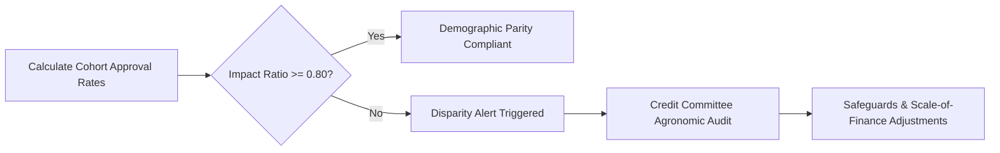

# AgriSahay Algorithmic Fairness & Bias Governance Framework

---

## 1. Governance Principles & Ethical Foundation

Algorithmic decision systems in rural credit delivery risk amplifying historical inequalities if unmonitored. AgriSahay implements a strict, rule-based governance framework anchored on three inviolable principles:

1. **Non-Autonomous Decision Guard:** The Explainable Farmer Resilience Index is strictly decision-support tooling. It never autonomously sanctions, denies, or adjusts loan limits. All credit sanctions require human loan officer sign-off.
2. **Transparent Agronomic Weights:** Every score is calculated as a visible sum of 7 transparent agronomic factors. No black-box machine learning models or opaque neural networks are deployed.
3. **Continuous Disparate Impact Monitoring:** Demographic cohorts (landholding tiers, gender, irrigation regimes) are monitored across approval rates and average interest rates using the standard four-fifths rule.

---

## 2. Demographic Cohort Classification

| Cohort Dimension | Categories Monitored | Vulnerability Rationale |
| :--- | :--- | :--- |
| **Landholding Size** | Marginal ($< 1.0$ ha), Small ($1.0 - 2.0$ ha), Semi-Medium ($> 2.0$ ha) | Marginal holders frequently lack collateral and formal titling. |
| **Gender of Borrower** | Female Borrowers, Male Borrowers | Women cultivators perform $\sim 70\%$ of agricultural labor but face lower land ownership rates. |
| **Water Security Regime** | Rainfed / Dryland, Canal / Well Irrigated | Rainfed farms endure extreme rainfall exposure and historical credit rationing. |
| **Crop Diversity** | Monoculture, Polyculture / Multi-Cropping | Monocrop farmers face amplified market and pest shocks. |

---

## 3. Disparate Impact Metric & The Four-Fifths (80%) Rule

To assess demographic fairness, AgriSahay applies the established Equal Employment Opportunity Commission (EEOC) Disparate Impact Ratio:

$$\text{Impact Ratio} = \frac{\text{Approval Rate of Protected / Vulnerable Cohort}}{\text{Approval Rate of Benchmark Cohort}}$$

### Decision Boundary
- **$\text{Impact Ratio} \ge 0.80$ (80%):** Compliant. No evidence of systemic disparate impact.
- **$\text{Impact Ratio} < 0.80$ (< 80%):** Disparity Alert Triggered. System requires senior credit committee review to audit whether underwriting criteria disproportionately penalize vulnerable groups.

---

## 4. Privacy Threshold & $k$-Anonymity Suppression ($N < 5$)

In rural taluks and village clusters, reporting granular metrics for very small cohorts can inadvertently deanonymize individual borrowers. 

### Suppression Policy
If any demographic bucket contains fewer than 5 borrowers ($N < 5$):
- **Raw Count:** Suppressed to `[Suppressed: N < 5]`.
- **Approval Rate / Average Score:** Replaced with `Not Disclosed (N < 5)`.
- **Reason Code:** Recorded as `DPDP Privacy Threshold Enforced`.

This guarantees compliance with the Digital Personal Data Protection (DPDP) Act 2023.

---

## 5. Discretionary Override Logging & Governance

When a credit officer identifies unrecorded agronomic safeguards (e.g., newly installed drip irrigation, Kisan Credit Card limit enhancement, or dairy self-help group participation):
1. The officer can record a discretionary resilience score adjustment.
2. **Mandatory Audit Trail:** The officer must provide their identity, role, timestamp, and a detailed text justification ($> 10$ characters).
3. The override is written into the tamper-evident cryptographic audit chain.
4. Overrides are highlighted with an `Officer Override` amber badge to alert senior credit underwriters.
