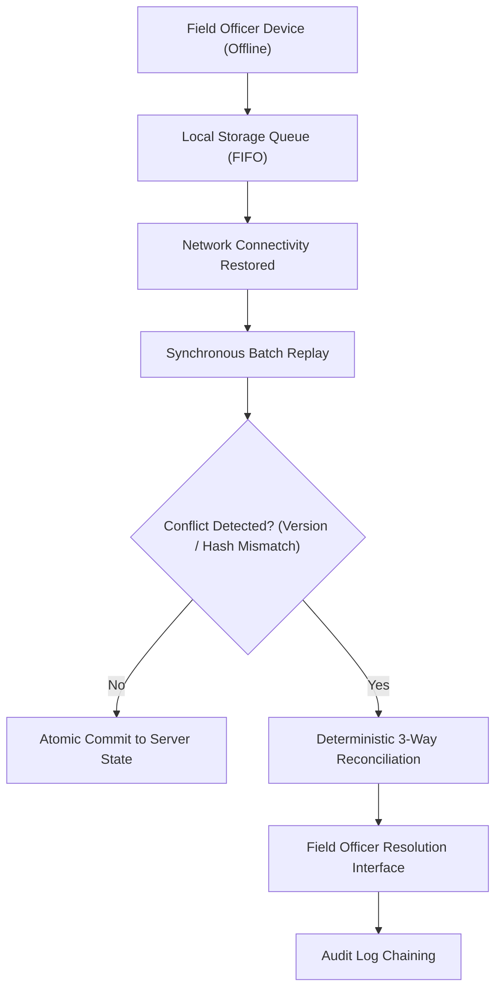

# AgriSahay Offline-First Architecture & Conflict Reconciliation Design

---

## 1. Context & Operational Constraints
In Indian rural agricultural banking, field relationship officers spend $70\%$ of their working hours traveling between villages with intermittent $2\text{G}/3\text{G}$ cellular connectivity. Standard web applications that require continuous network round-trips fail in these connectivity shadow zones.

AgriSahay employs an **offline-first, queue-backed architecture** designed to operate autonomously without network connectivity, while guaranteeing deterministic, collision-free synchronization upon reconnection.

---

## 2. Dual-Officer Collision Scenarios
In real banking operations, synchronization conflicts occur in two common patterns:

1. **Concurrent Field Verification Collision:**
   - Officer A in the village updates a farmer's plot status to *"Drip Irrigated"* at 10:15 AM while offline.
   - Officer B at the branch updates the same farmer's contact phone number at 10:20 AM.
   - When Officer A connects to the branch network at 1:00 PM, a naive "last write wins" strategy would overwrite Officer B's phone update or discard Officer A's agronomic data.
2. **Duplicate Application Origination:**
   - A farmer visits a mobile credit camp and an officer creates an application offline.
   - Simultaneously, a branch operator enters a loan application for the same Aadhaar/Kisan Credit Card.

---

## 3. Deterministic 3-Way Reconciliation Algorithm

AgriSahay enforces atomic, field-level 3-way reconciliation:

$$\text{Resolved Record} = \text{Merge}(\text{Base Record}, \text{Local Field Write}, \text{Remote Branch State})$$

### Conflict Detection Rule
Each record carries a monotonically increasing version number $V$ and a content hash $H$:
- If $\text{Local}.V_{\text{base}} < \text{Remote}.V$, a collision is declared.
- The record is quarantined in the **Offline Conflict Center** (`/conflict-center`).
- Both records are displayed side-by-side with diff highlighting.

### Field-Level Merge Options
1. **Keep Local (Field Inspection):** Preserves field officer's physical observation (e.g., crop health, actual acreage).
2. **Keep Remote (Core Branch State):** Preserves branch-sanctioned credit limits or KYC verification.
3. **Atomic Field-by-Field Merge:** Officer selects individual fields (e.g., local drip irrigation status + remote mobile number).
4. **Mandatory Resolution Rationale:** Every conflict resolution requires a text comment entered by the resolving officer, logged directly into the tamper-evident audit trail.

---

## 4. Exponential Backoff & Retry Protocol

When synchronization fails due to intermittent packet drops:
1. **Initial Retry:** After $2$ seconds.
2. **Backoff Multiplier:** $2\times$ per failed attempt with randomized jitter ($\pm 20\%$).
3. **Formula:**
   $$t_{\text{wait}} = \min(t_{\text{max}}, t_{\text{base}} \times 2^{\text{attempt}} \pm \text{jitter})$$
4. **Max Backoff:** $60$ seconds.
5. **Circuit Breaker:** After 5 failed sync attempts, the system flags the queue as *“Paused: Waiting for Stable Uplink”* to prevent battery drain on field tablets.
